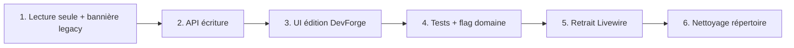

# DevForge — Migration Livewire → UI moderne

Ce document définit **quand un domaine est prêt à couper le legacy**, l’**état actuel** de la migration, et le **plan d’organisation** du répertoire `frontend/` pour le nettoyage final.

## Objectif

Remplacer l’**interface** Coolify (Livewire/Blade) par DevForge (Astro + Preact), en conservant le **backend Laravel** (modèles, jobs, SSH, Docker, policies).

« Couper le legacy » pour un domaine signifie :

1. Toutes les routes du domaine sont servies sous `/devforge/…`
2. L’utilisateur peut **lire et agir** sans ouvrir Coolify
3. Les `LegacyEditBanner` du domaine sont supprimées
4. Les composants Livewire et vues Blade du domaine peuvent être retirés (après une période de grace avec `?legacy=1`)

Référence technique : matrice `config/devforge.php` + middleware `RedirectToDevForge`.

---

## Checklist « prêt à couper le legacy » (par domaine)

Chaque ligne du tableau doit être **cochée** avant de retirer l’UI Livewire du domaine.

| Critère | Description |
|--------|-------------|
| **R** Routes | `routes.ts` + chemins statiques Astro + `findRoute()` couvrent toutes les URLs du domaine |
| **P** Pages | Page(s) Preact dédiée(s), sans stub « page introuvable » |
| **L** Lecture API | `GET` DevForge pour toutes les données affichées |
| **E** Écriture API | `POST` / `PUT` / `PATCH` / `DELETE` pour chaque action utilisateur du domaine |
| **U** UI complète | Formulaires, confirmations, erreurs de validation — **sans** `LegacyEditBanner` |
| **T** Temps réel | WebSockets / polling si le Livewire d’origine écoutait des canaux équipe |
| **A** Auth | Policies / gates alignées avec Livewire (`canGate`, rôles équipe) |
| **V** Tests front | Vitest : routage + composants critiques du domaine |
| **F** Tests back | Pest Feature : endpoints du domaine (équipe courante, 403, masquage secrets) |
| **D** Flag domaine | `DEVFORGE_*_ENABLED=true` en prod sans régression connue |
| **X** Retrait legacy | Livewire + vues Blade + routes web legacy supprimables |

### Légende état (snapshot juillet 2026)

- ✅ Fait — ⚠️ Partiel — ❌ Manquant — ➖ N/A

| Domaine | R | P | L | E | U | T | A | V | F | D | X | Notes |
|---------|---|---|---|---|---|---|---|---|---|---|---|-------|
| **dashboard** | ✅ | ✅ | ✅ | ➖ | ✅ | ⚠️ | ✅ | ✅ | ✅ | ✅ | ❌ | Vue d’ensemble OK ; temps réel partiel |
| **applications** | ✅ | ✅ | ✅ | ⚠️ | ⚠️ | ⚠️ | ✅ | ✅ | ✅ | ✅ | ❌ | Deep-links `?tab=` + webhooks + tasks + previews + storages + resource-limits + advanced + clone/move ; metrics / GPU encore absents |
| **databases** | ✅ | ✅ | ✅ | ⚠️ | ⚠️ | ⚠️ | ✅ | ✅ | ✅ | ✅ | ❌ | Deep-links + backups/import/explorer/logs/variables/webhooks/storages/healthcheck ; metrics encore absents |
| **services** | ✅ | ✅ | ✅ | ✅ | ✅ | ⚠️ | ✅ | ⚠️ | ✅ | ✅ | ❌ | Détail + tâches + variables + webhooks + storages (lecture) ; deep-links Coolify `…/service/…` |
| **deployments** | ✅ | ✅ | ✅ | ⚠️ | ⚠️ | ⚠️ | ✅ | ✅ | ✅ | ✅ | ❌ | File + logs ; pas toutes actions queue |
| **monitoring** | ✅ | ✅ | ✅ | ➖ | ✅ | ⚠️ | ✅ | ✅ | ⚠️ | ✅ | ❌ | Lecture supervision |
| **settings** (compte) | ✅ | ✅ | ✅ | ⚠️ | ⚠️ | ➖ | ✅ | ✅ | ✅ | ✅ | ❌ | Profil éditable ; 2FA/apparence legacy |
| **settings** (projets) | ✅ | ✅ | ✅ | ✅ | ✅ | ➖ | ✅ | ✅ | ✅ | ✅ | ❌ | CRUD projets/environnements — UI sans bannière |
| **settings** (serveurs liste) | ✅ | ✅ | ✅ | ❌ | ❌ | ➖ | ✅ | ⚠️ | ✅ | ✅ | ❌ | Liste dans onglet paramètres |
| **settings** (équipe) | ✅ | ✅ | ✅ | ✅ | ✅ | ➖ | ✅ | ✅ | ✅ | ✅ | ❌ | CRUD équipe + membres + invitations |
| **settings** (instance) | ✅ | ✅ | ✅ | ❌ | ❌ | ➖ | ✅ | ⚠️ | ✅ | ✅ | ❌ | Instance/avancé/email/oauth/updates lecture seule |
| **settings** (notifications) | ✅ | ✅ | ✅ | ✅ | ✅ | ➖ | ✅ | ⚠️ | ✅ | ✅ | ❌ | Événements + credentials (secrets masqués) |
| **settings** (variables) | ✅ | ✅ | ✅ | ✅ | ✅ | ➖ | ✅ | ✅ | ✅ | ✅ | ❌ | CRUD par portée ; secrets masqués |
| **settings** (sécurité) | ✅ | ✅ | ⚠️ | ⚠️ | ⚠️ | ➖ | ✅ | ⚠️ | ✅ | ✅ | ❌ | Clés + api-tokens + cloud-tokens natifs ; cloud-init encore legacy |
| **security** | ✅ | ✅ | ⚠️ | ⚠️ | ⚠️ | ➖ | ✅ | ⚠️ | ✅ | ✅ | ❌ | Clés + api-tokens + cloud-tokens ; cloud-init legacy |
| **settings** (S3) | ✅ | ✅ | ✅ | ✅ | ✅ | ➖ | ✅ | ⚠️ | ✅ | ✅ | ❌ | CRUD storages |
| **settings** (IA) | ✅ | ✅ | ✅ | ⚠️ | ⚠️ | ➖ | ✅ | ⚠️ | ✅ | ✅ | ❌ | Providers agents |
| **settings** (backup, jobs) | ✅ | ✅ | ❌ | ❌ | ❌ | ➖ | ✅ | ❌ | ❌ | ✅ | ❌ | Panneau legacy only |
| **profile** | ✅ | ✅ | ✅ | ⚠️ | ⚠️ | ➖ | ✅ | ✅ | ✅ | ✅ | ❌ | Compte + apparence DevForge ; mot de passe/2FA via Fortify |
| **notifications** (canaux) | ✅ | ✅ | ✅ | ✅ | ✅ | ➖ | ✅ | ⚠️ | ✅ | ✅ | ❌ | `PUT` événements + credentials ; secrets masqués |
| **shared-variables** | ✅ | ✅ | ✅ | ✅ | ✅ | ➖ | ✅ | ✅ | ✅ | ✅ | ❌ | CRUD par portée — UI sans bannière |
| **team** | ✅ | ✅ | ✅ | ✅ | ✅ | ➖ | ✅ | ✅ | ✅ | ✅ | ❌ | CRUD équipe + membres + invitations |
| **terminal** | ✅ | ✅ | ✅ | ✅ | ✅ | ⚠️ | ✅ | ❌ | ⚠️ | ✅ | ❌ | xterm interactif + `POST /terminal/session` |
| **sources** | ✅ | ✅ | ✅ | ❌ | ❌ | ➖ | ✅ | ❌ | ✅ | ✅ | ❌ | Liste GitHub ; détail legacy |
| **destinations** | ✅ | ✅ | ✅ | ✅ | ✅ | ➖ | ✅ | ⚠️ | ✅ | ✅ | ❌ | CRUD + resources — UI sans bannière |
| **tags** | ✅ | ✅ | ✅ | ✅ | ✅ | ➖ | ✅ | ✅ | ✅ | ✅ | ❌ | CRUD + redeploy massif |
| **servers** (détail) | ✅ | ✅ | ✅ | ⚠️ | ⚠️ | ➖ | ✅ | ⚠️ | ✅ | ✅ | ❌ | overview/files/resources/destinations/cleanup/terminal/proxy/swarm/sentinel natifs ; logs proxy/sentinel + actions agent legacy |
| **projects** (routes legacy) | ✅ | ✅ | ✅ | ✅ | ✅ | ➖ | ✅ | ✅ | ✅ | ✅ | ❌ | `/project/*` → settings projets DevForge |
| **storage** (`/storages`) | ✅ | ✅ | ✅ | ✅ | ✅ | ➖ | ✅ | ⚠️ | ✅ | ✅ | ❌ | Page standalone + CRUD S3 — UI sans bannière |
| **subscription** | ✅ | ✅ | ⚠️ | ❌ | ❌ | ➖ | ✅ | ❌ | ❌ | ✅ | ❌ | Bootstrap cloud ; Stripe legacy |
| **onboarding** | ✅ | ✅ | ✅ | ➖ | ✅ | ➖ | ✅ | ❌ | ❌ | ✅ | ❌ | Wizard GitHub / S3 / serveur |
| **authentication** | ⚠️ | ❌ | ⚠️ | ⚠️ | ❌ | ➖ | ✅ | ⚠️ | ⚠️ | ⚠️ | ❌ | Fortify hors shell — `.ai/devforge/authentication.md` |
| **agents** | ✅ | ✅ | ✅ | ✅ | ✅ | ⚠️ | ✅ | ✅ | ✅ | ⚠️ | ❌ | Feature flag `DEVFORGE_AGENTS_ENABLED` |

> Mettre à jour ce tableau à chaque domaine complété. Un domaine n’est **X** que lorsque l’équipe valide en staging avec `?legacy=0` forcé.

---

## Phases de migration (workflow)



### Phase 1 — Lecture seule (actuel pour beaucoup de domaines)

- Page DevForge + `GET` API
- `LegacyEditBanner` vers Coolify pour l’édition

### Phase 2 — API écriture

- Endpoints miroir des actions Livewire (validation inline, policies)
- Pas de secrets en clair dans les réponses (voir `InstanceSettingsPresenter`)

### Phase 3 — UI complète

- Retirer `LegacyEditBanner` du domaine
- Parité UX : confirmations, toasts, états chargement (`DataState`, `ConfirmDialog`)

### Phase 4 — Qualité & activation

```bash
# Front
cd frontend && npm test && npm run build
# ou : npm run test:frontend && npm run build:frontend

# Back (Docker)
docker exec coolify php artisan test --compact tests/Feature/DevForge*.php
```

### Phase 5 — Retrait legacy

- Supprimer `app/Livewire/<Domaine>/`
- Supprimer `resources/views/livewire/<domaine>/`
- Retirer entrées routes web si plus utilisées
- Garder `?legacy=1` global jusqu’à la fin de **tous** les domaines critiques

### Phase 6 — Nettoyage répertoire (ce document, section suivante)

---

## Structure cible `devforge/src/` (après migration)

Organisation par **domaine métier**, pas par type technique dispersé. Objectif : retrouver une page et ses composants au même endroit.

```
devforge/src/
├── components/
│   ├── layout/                 # App, AuthGuard, Sidebar, Topbar, PageHeader, TeamSwitcher, ToastRegion
│   ├── ui/                     # Design system (Card, Table, Tabs, DataState, …) — ne pas mélanger métier
│   ├── migration/              # LegacyEditBanner, LegacyOnlyPanel (supprimable domaine par domaine)
│   ├── applications/
│   ├── databases/
│   ├── services/
│   ├── deployments/
│   ├── monitoring/
│   ├── agents/
│   ├── settings/               # Panneaux onglets paramètres
│   ├── shared-variables/
│   ├── storages/
│   ├── servers/
│   ├── destinations/
│   ├── tags/
│   ├── profile/
│   ├── terminal/
│   └── sources/
│
├── pages/
│   ├── router.tsx              # ex-_domain-pages.tsx : switch route → page
│   ├── dashboard/
│   │   └── OverviewPage.tsx
│   ├── applications/
│   │   ├── ApplicationsPage.tsx      # ex-_CoreResourcesPage (type applications)
│   │   └── ApplicationDetailRoute.tsx  # si routage dédié
│   ├── databases/
│   ├── services/
│   ├── deployments/
│   ├── monitoring/
│   ├── settings/
│   │   ├── SettingsPage.tsx
│   │   └── SecurityPage.tsx
│   ├── shared-variables/
│   ├── servers/
│   │   └── ServerPage.tsx
│   ├── destinations/
│   ├── tags/
│   ├── profile/
│   ├── terminal/
│   ├── sources/
│   ├── subscription/
│   ├── onboarding/
│   └── agents/
│
├── lib/
│   ├── api/
│   │   ├── client.ts           # ex-api-client.ts
│   │   └── domain.ts           # ex-domain-api.ts (ou découpé par domaine si > 1500 lignes)
│   ├── routing/
│   │   ├── paths.ts            # ex-route-path.ts
│   │   ├── routes.ts
│   │   ├── settings-tabs.ts
│   │   ├── server-sections.ts
│   │   └── shared-variables-routes.ts
│   ├── hooks/
│   │   ├── use-api-query.ts
│   │   ├── use-navigate.ts
│   │   └── use-deployment-logs.ts
│   ├── domain/                 # Logique pure (pas de JSX)
│   │   ├── bootstrap.ts
│   │   ├── resource-status.ts
│   │   ├── deployment-status.ts
│   │   ├── application-config.ts
│   │   └── …
│   ├── migration.ts            # legacyCoolifyUrl, helpers migration
│   ├── brand.ts
│   └── theme.ts
│
├── styles/
│   └── global.css
│
└── pages/                      # Astro (build statique)
    └── [...path].astro
```

### Conventions de nommage

| Avant (transition) | Après (cible) |
|--------------------|---------------|
| `_SettingsPage.tsx` | `pages/settings/SettingsPage.tsx` |
| `_CoreResourcesPage.tsx` | Découper par type dans `pages/applications/`, `pages/databases/`, … |
| `components/settings/SettingsPanels.tsx` | `components/migration/LegacyEditBanner.tsx` + `components/settings/…` |
| Préfixe `_` sur les pages | Supprimé : réservé aux fichiers privés Astro si besoin |

### Règles d’organisation

1. **Une page = un fichier** dans `pages/<domaine>/`, export nommé `XxxPage`.
2. **Composants réutilisés par une seule page** → sous-dossier du domaine (`components/destinations/DestinationCard.tsx`).
3. **Composants partagés** → `components/ui/` ou `components/layout/`.
4. **`lib/` sans JSX** : tests unitaires faciles, pas d’import Preact dans `lib/domain/`.
5. **Tests miroir** : `devforge/tests/routing/`, `devforge/tests/pages/`, `devforge/tests/components/<domaine>/`.
6. **Preact uniquement** pour les composants interactifs (pas React).

---

## Checklist nettoyage final du répertoire (une fois migration terminée)

À exécuter quand **tous** les domaines critiques sont en colonne **X**.

### Répertoire `frontend/`

- [ ] Renommer/déplacer les pages `_*.tsx` vers `pages/<domaine>/`
- [ ] Extraire `LegacyEditBanner` vers `components/migration/` ; supprimer le dossier si vide
- [ ] Découper `domain-api.ts` si nécessaire (`lib/api/applications.ts`, `lib/api/settings.ts`, …)
- [ ] Regrouper les tests par domaine
- [ ] Supprimer imports morts et barrels inutiles
- [ ] Vérifier `staticRoutePaths` = union des routes de la matrice `config/devforge.php`
- [ ] `npm run build` → compter les pages statiques vs matrice (écart documenté)

### Répertoire `public/devforge/`

- [ ] Build Astro uniquement via CI / `npm run build` (pas de commits manuels de `_astro/` obsolètes)
- [ ] `.gitignore` pour artefacts regénérables si pas déjà fait

### Répertoire Laravel (hors `frontend/`)

- [ ] Retirer `app/Livewire/` par domaine migré
- [ ] Retirer `resources/views/livewire/` correspondant
- [ ] Nettoyer `routes/web.php` (routes devenues mortes)
- [ ] Conserver `config/devforge.php` : passer les domaines en « toujours DevForge » ou fusionner les flags
- [ ] Retirer `LegacyInterfacePreference` et `RedirectToDevForge` quand plus aucun fallback
- [ ] Documenter dans `.ai/` le stack final (une seule UI)

### Validation finale

- [ ] Parcours smoke : login → dashboard → créer app → déployer → paramètres → terminal
- [ ] Tests Feature DevForge complets dans Docker
- [ ] Tests Vitest complets
- [ ] Pint sur PHP modifié

---

## Suivi recommandé

1. Choisir le **prochain domaine** selon la colonne la moins remplie (souvent : API **E** puis UI **U**).
2. Mettre à jour le tableau d’état dans ce fichier dans le même PR que la feature.
3. Ne pas réorganiser les dossiers en profondeur **avant** la phase 6 — seulement pour les **nouveaux** fichiers, suivre déjà la structure cible (ex. `components/destinations/`, `pages/destinations/`).

---

## Références

- Matrice routes : `config/devforge.php`
- Redirection : `app/Http/Middleware/RedirectToDevForge.php`
- Préférence legacy : `app/Support/DevForge/LegacyInterfacePreference.php` (`?legacy=1`)
- API : `routes/devforge-api.php` et fichiers `routes/devforge-*.php`
- Routage front : `devforge/src/lib/routes.ts`

---

## Décision architecture : un repo ou plusieurs ?

**Décision (juillet 2026) : garder DevForge dans le repo Coolify** pendant toute la migration.

| Option | Verdict |
|--------|---------|
| Sous-dossier `coolify/frontend/` | ✅ Actuel — sources UI |
| Monorepo `backend/` + `frontend/` | ✅ Laravel → `backend/`, UI → `frontend/` — voir [`.ai/devforge/monorepo.md`](../.ai/devforge/monorepo.md) |
| Repo Git `devforge` séparé | ❌ Pas maintenant — coupling auth, API, déploiement Docker |
| Merger Forge/Ageton | ❌ Hors périmètre — produit séparé |

Un repo séparé n’apporte pas de propreté suffisante pour compenser la coordination API/UI et le déploiement. La propreté vient de la **structure interne** (structure cible ci-dessus) et du retrait progressif du legacy.

**Doc AI** : [`.ai/README.md`](../.ai/README.md) + [`.ai/devforge/migration.md`](../.ai/devforge/migration.md) pointent vers ce fichier comme source de vérité.

---

## Roadmap d’exécution (ordre de migration)

Chaque vague vise le critère **E** (API écriture) + **U** (UI sans bannière) avant **X** (retrait Livewire).

### Vague 1 — Domaines quasi prêts (API CRUD existante)

| # | Domaine | Travail restant | Statut |
|---|---------|-----------------|--------|
| 1 | **storage** (`/storages`) | Page standalone + CRUD S3 sans bannière | ✅ Fait |
| 2 | **settings / projets** | CRUD + UI sans bannière | ✅ Fait |
| 3 | **profile** | ✅ Compte + apparence ; 2FA/mot de passe legacy Fortify |

### Vague 2 — Lecture OK, API écriture

| # | Domaine | Travail | Statut |
|---|---------|---------|--------|
| 4 | **notifications** | `PUT` événements + enabled + credentials (secrets masqués) | ✅ Fait |
| 5 | **shared-variables** | CRUD par scope — UI sans bannière | ✅ Fait |
| 6 | **destinations** | CRUD + resources — UI sans bannière | ✅ Fait |
| 7 | **tags** | CRUD + redeploy massif | ✅ Fait |
| 8 | **team** | CRUD équipe + membres + invitations | ✅ Fait |

### Vague 3 — Sous-pages & actions lourdes

| # | Domaine | Travail | Statut |
|---|---------|---------|--------|
| 9 | **servers** | + proxy (lecture) + swarm/sentinel (édition settings) ; logs & actions agent encore legacy | Partiel |
| 10 | **applications** | Sous-routes logs, env, webhooks, source, domains | Partiel (détail riche) |
| 11 | **databases** | Backups UI + explorer + import | Partiel |
| 12 | **services** | Panneau détail + deep-link `?uuid=` | ✅ |
| 13 | **terminal** | xterm interactif + `POST /terminal/session` | ✅ |

### Vague 4 — Cloud & gouvernance

| # | Domaine | Travail | Statut |
|---|---------|---------|--------|
| 14 | **subscription** | Lecture cloud + Stripe legacy | Partiel (UI DevForge + bannière Stripe) |
| 15 | **onboarding** | Wizard multi-étapes DevForge | ✅ Compte + GitHub + S3 + serveur |
| 16 | **authentication** | Fortify hors SPA (décision documentée) | ✅ Voir `.ai/devforge/authentication.md` |
| 17 | **admin** | Cloud/dev stats | À faire |

### Règle pour les nouveaux fichiers (dès maintenant)

```
pages/<domaine>/_<Domaine>Page.tsx   # préfixe _ obligatoire (Astro ignore ces fichiers)
components/<domaine>/
lib/routing/<domaine>-routes.ts      # si helpers de route dédiés
```

Ne pas déplacer les anciens `_*.tsx` à la racine de `pages/` tant que la vague 1 n’est pas stable.

